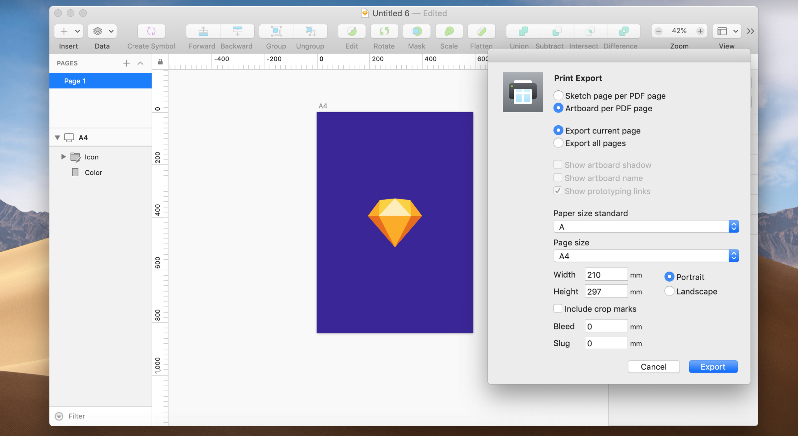

# Print Export Plugin

With this plugin you can export one Artboard per PDF page for printing, or export all Artboards on one Sketch page to a PDF to share User flows or prototyping overviews.

You can choose to show Artboard names, shadows and prototyping links, export to a variety of standard paper sizes in landscape or portrait orientation, and even add bleed and crop marks.

## Installation

### From a release (simplest)

- Download the [latest release](https://github.com/sketch-hq/print-export-sketchplugin/releases/latest/download/print-export.sketchplugin.zip)  of the plugin
- Double-click the .zip archive to extract the plugin
- Double-click `print-export.sketchplugin` to install the plugin

### From source

You'll need [Xcode](https://itunes.apple.com/app/xcode/id497799835?mt=12) and Xcode Command Line Tools (`xcode-select --install`) installed.

- Clone the repo
- Install the dependencies with `npm install`

## Usage

1. Open the Sketch document you want to generate a PDF from
1. Go to _Plugins_ › _Print Export_
1. Choose your options and press _Export_
1. Choose a name for your PDF file and the location you want to save it and press _Export_

In the options dialog you can specify bleed and slug. Bleed is the area that's trimmed off the page after printing, while the slug is the area beyond the bleed that contains crop marks. If you don't want to include either of these in your export, enter 0. If you do want crop marks in your export, be sure to check the "Include crop marks option" and enter a value greater than 0 for the slug. The size of the page specified is the size of the trimmed area.
